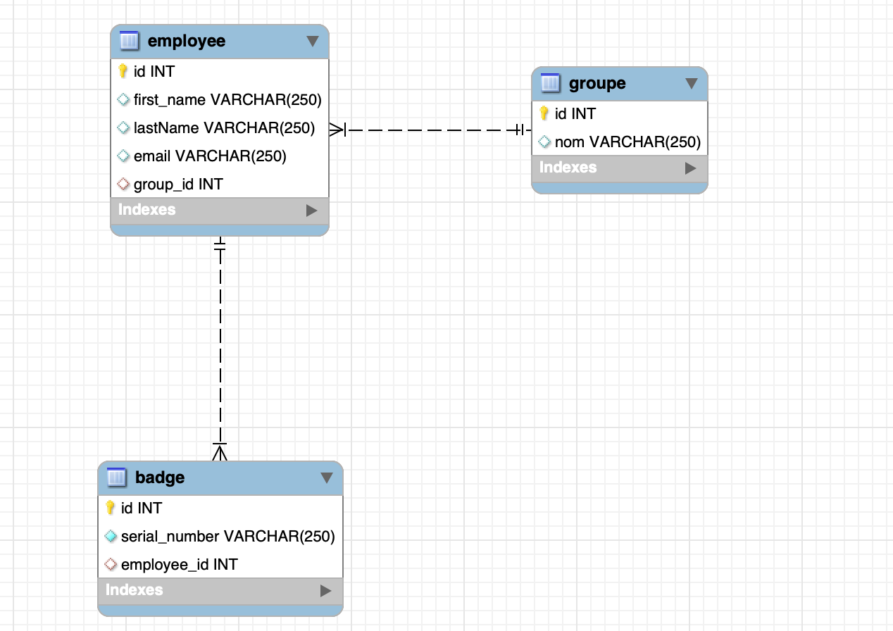
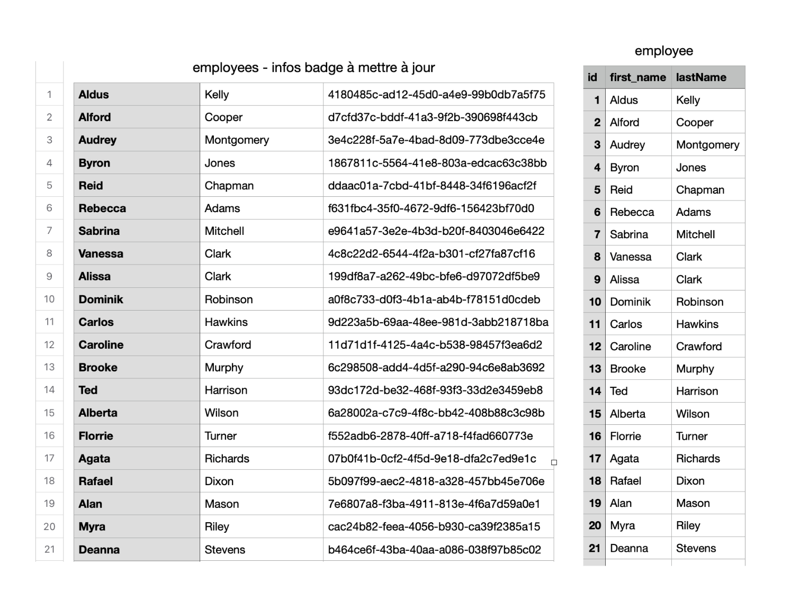
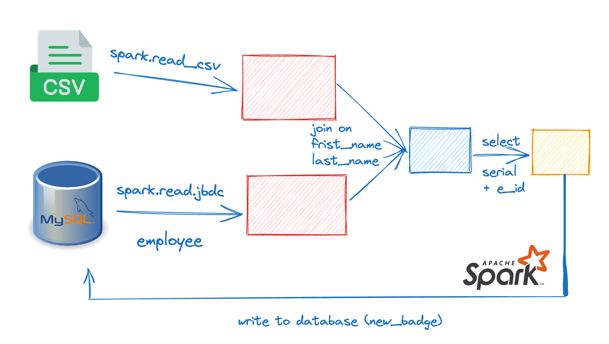

# Report techtechnique
## Question 1: Analysis of the data model
Currently, the tech stack include:

 - MySQL server implement with docker compose
 - Database include 3 tables 
	 - employee(id, first_name, lastName, email, group_id)
	 - groupe(id, nom)
	 - badge(id, serial_number, employee_id)

<p align="center">

</p>


### Comments: 

 1. Because of these problem have very simple database, so MySQL works well, but in real word, we should use Oracle,PostgreSQL or Microsoft SQL Server

 2. Problem of docker-compose: The current password is password is not secure and it sets directly on docker environment variable, that is not best practices.  I recommend to use **`MYSQL_RANDOM_ROOT_PASSWORD`**  and then save the password to secure location or use (prefer) **`MYSQL_ROOT_PASSWORD_FILE`** to set the password. Read more at MySQL [document](https://dev.mysql.com/doc/mysql-installation-excerpt/8.0/en/docker-mysql-more-topics.html#docker_var_mysql-root-password). Another options by using [docker secret](https://blog.ruanbekker.com/blog/2017/11/23/use-docker-secrets-with-mysql-on-docker-swarm/)

 3. The database is not well design (base on name convension of the columns).  We should change it to:
	- employee(**employee_id**, first_name, **last_name**, groupe_id)
	- groupe(**groupe_id**, **groupe_name**) (I still use `groupe` table not `group` because `group` is **reserved keyword**) may be we can name as `departement`.
	- badge(**badge_id**, **badge_serial_number**, employee_id)

## Question 2: Analysis of the quality of existing data
### Analysis data
 1. Let take a look at the number of each table:

| table | count | null |
| :--- | :--- | :--- |
| badge | 1000 | 0 |
| employee | 1171 | 12 |
| groupe | 8 | 1 |

We can see that we have total 1171 employee, but we have only 1000 badge. The table group have 1 null value of `groupe_nom` and have 2 `External` value
	
2. Check duplicate data: in the table badge, the are we want to make sure every employee have only one badge, but in the current database, 
```sql
select employee_id, count(employee_id) as count_id from badge
group by employee_id
order by count_id desc
limit 3;
```
**Result**:
| employee_id | count |
|-------------|-------|
| 529         | 5     |
| 251         | 5     |
| 849         | 4     |

3. We also want to check the duplicate data of employee
```sql
SELECT e1.*
FROM employee e1
JOIN employee e2 ON e1.first_name = e2.first_name AND e1.lastName = e2.lastName
WHERE e1.id <> e2.id
order by e1.first_name;
```
| id | first_name | last_name | email | groupe_id |
| :--- | :--- | :--- | :--- | :--- |
| 1170 | Elian | Foster | elian.foster@acme.com | 1 |
| 808 | Elian | Foster | elian.foster@acme.com | 1 |
| 1171 | Freddie | Brooks | freddie.brooks@acme.com | 2 |
| 809 | Freddie | Brooks | freddie.brooks@acme.com | 1 |
| 1169 | Isabella | Kelly | isabella.kelly@acme.com | 1 |
| 960 | Isabella | Kelly | isabella.kelly@acme.com | 3 |
| 656 | Lucy | Baker | lucy.baker@acme.com | 6 |
| 1168 | Lucy | Baker | lucy.baker@acme.com | 3 |

4. We also want to check the correctness  of data in `employee` table: for example: email is valid, we have both `first_name` and `last_name`
```sql
SELECT id, email
FROM acme.employee
WHERE email NOT LIKE '%_@__%.__%'
limit 3;
```
| id | email |
|-------------|-------|
| 650         | maria.coleatacme.com     |
| 831         | maddie.warrenvacme.com     |
| 957         | sydney.perkins.acme.com     |

or query valid first_name, last_name

```sql
SELECT id, first_name, lastName, email
FROM acme.employee
WHERE first_name = '' or lastName = ''
limit 4;
```
| id | first_name | lastName | email |
| :---: | :---: | :---: | :---: |
| 50 | Alberta |  | alberta.parker@acme.com |
| 105 | Vincent |  | vincent.douglas@acme.com |
| 148 |  | Reed | alisa.reed@acme.com |
| 186 |  |  | aiden.kelley@acme.com |

=> we can conclude that the database have some quality issues, and we can fix that by:

 - Update `last_name`, `fist_name`, `email` by process: `email=first_name.last_name@acme.com`
 - 

### Data Quality DashBoard:
Currently, I just thinking about create a dash bash that contains the cout of each table, and maybe some duplicates data.
I create a dashboard by using Redash, you can check at that [link](http://34.155.163.109/public/dashboards/eAitZrr7GbGNsbuX0xcLzyIgEevDdqrnegDjUREQ?org_slug=default): 

## Integration of new data

### 0. Start database
```
docker compose up -d
```

### 1. Simple way (Python as ETL)



Let's take a look at the `employees - infos badge à mettre à jour.csv` file, and we see that we have **`1171`**  lines, correspondence 1171 employee, and when we compare with the `employee` table in database, the order is the same (first_name, lastName,... ). That lead to we can get the employee_id from this file. So basicly, the algorithm to update the  `employee` table is:

 1. Read employee `first_name`, `last_name`, `serial_number` from csv file
 2. The `employee_id` is the index of each line
 3.  Update new record to `new_badge` table (I think we can drop the table, and write a new one because we have only 679 employee_id and the write task take little time than delete, modify the existing table)

```python
df = pd.read_csv("./employees - infos badge à mettre à jour.csv")
df['index'] = range(1, len(df) + 1)
df_val = df[['employee_first_name', 'employee_last_name', 'badge_serial_number', 'index']].fillna("").values
mydb = mysql.connector.connect(...)
mycursor = mydb.cursor()

for x in df_val:
    try:
        sql = "INSERT INTO new_badge (badge_serial_number, employee_id) VALUES (%s, %s)"
        val = (x[2], x[3])
        mycursor.execute(sql, val)
        mydb.commit()
    except Exception as e:
        print(e)
```
### 2. Spark


The pipeline for apache spark:

1. We read data from CSV file (df1) and MySQL (df2)
2. We join 2 dataframe by `first_name` and `last_name`
3. We select `serial_number` and `employee_id` 
4. Write result to new dataframe

How to run:

1. Config hostname, port, user of MySQL from `.env` file
2. `pip install -r requirements.txt`
3. Run ingest: `export mysql_password=password | python ingest_pyspark.py` this command make our password more secure.

### 3. Apache Beam

With Apache beam, I have 2 solutions: 
 1. Use ParDo to process each row of PCollection
 2. Convert PCollection to dataframe and then join